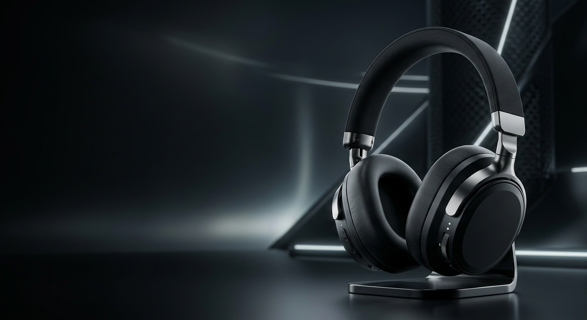
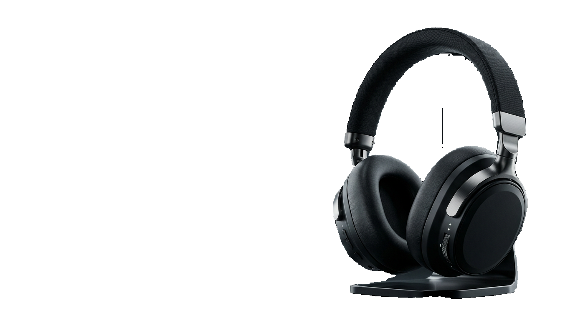

# red-chillies-ai-assessment

## Assessment 1 – Image Editing

### Project Overview

This assessment demonstrates AI-assisted image processing techniques including background extension, image upscaling, object addition, and object removal.

### Input

A street-market image was used as the source image for the image editing tasks.

### Tasks Completed

#### Output 1 – Background Extension and Upscaling

- Extended the background of the source image while maintaining visual continuity with the original scene.
- Upscaled the resulting image to improve resolution and preserve visual details.

#### Output 2 – Object Addition and Removal

- Added an object to the scene using AI-assisted image editing.
- Removed the added object while reconstructing the surrounding area naturally.

### Outputs

- `original.jpg` – Original input image
- `background_extended.jpg` – Background extension result
- `upscaled.jpg` – Upscaled image
- `object_added.jpg` – Image after object addition
- `object_removed.jpg` – Image after object removal

### Tools / Technique

AI-assisted image editing and image enhancement techniques were used for the required transformations.

### Limitations

The generated results may contain minor visual inconsistencies in complex areas of the scene, particularly around fine details and overlapping objects.

## Assessment 2 – AI Promotional Visual

### Project Overview

Created a high-quality promotional key visual for a fictional premium headphone brand, Aurallis, launching its new wireless headphone model, Aurallis Nova.

The visual was designed to communicate premium quality, modern technology, immersive sound, sophisticated design, and strong product focus.

### Tool Used

Adobe Firefly

### Visual Direction

- Premium cinematic product presentation
- Modern and sophisticated technology-focused aesthetic
- Aurallis Nova headphones as the dominant subject
- Dark, high-end environment
- Usable negative space for promotional text
- Landscape composition

### Output

### Output Specifications

- Orientation: Landscape
- Resolution: 1536 × 1024 pixels
- Format: PNG
- Product: Aurallis Nova wireless headphones

## Assessment 3 – Image Segmentation

### Project Overview

Created an image segmentation output to separate the target headphone object from the background.

### Task Completed

- Segmented the headphone object from the original image.
- Removed the surrounding background while preserving the headphone and its stand.
- Generated a transparent PNG cutout of the segmented object.

### Output

- `image_001.png` - Original input image
- `headphone_cutout.png` - Segmented headphone with the background removed

### Tools / Technique

AI-assisted image segmentation was used to separate the foreground headphone object from the background and generate the transparent PNG output.
